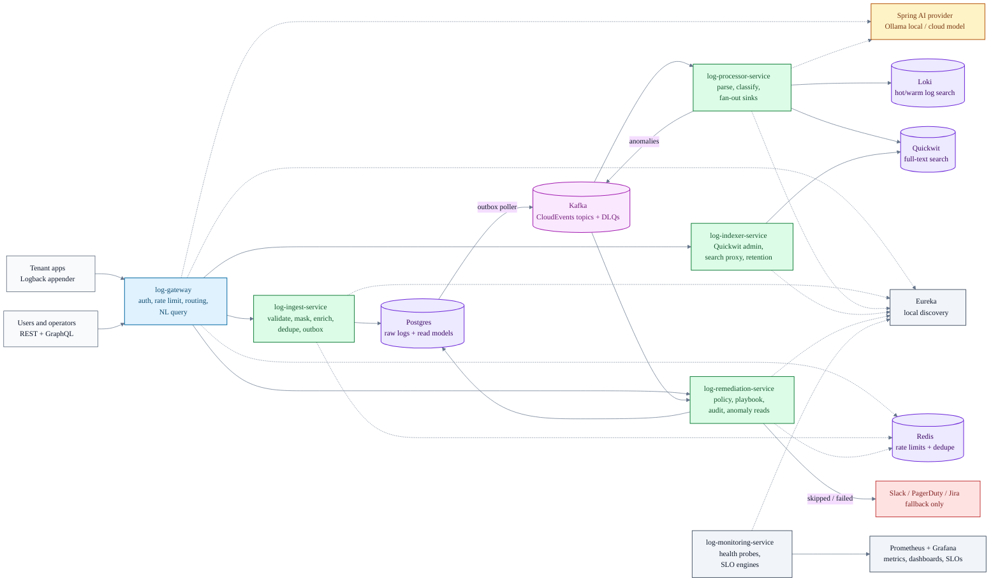

# CORTEX

**C**ognitive **O**bservability **R**untime **T**elemetry **EX**change.

AI-powered log management for multi-tenant systems: ingest logs, mask PII,
dedupe events, classify anomalies, fan out to search backends, and trigger
policy-gated remediation when something needs action.

[](https://adoptium.net/)
[](https://spring.io/projects/spring-boot)
[](https://spring.io/projects/spring-cloud)
[](https://spring.io/projects/spring-ai)
[](LICENSE)

---

## What CORTEX Does

- Accepts tenant-scoped log batches through a secured gateway.
- Masks sensitive fields before hashing and persistence.
- Uses Redis-backed idempotency to suppress duplicate events.
- Publishes CloudEvents through Kafka with transactional outbox guarantees.
- Classifies anomalies with Spring AI-backed providers.
- Writes to Loki and Quickwit for operational search.
- Exposes REST and GraphQL query surfaces.
- Runs fix-first remediation with audited outcomes and human fallback.
- Ships with Docker Compose, Helm, Terraform, Ansible, Grafana, Prometheus,
  Postman, and CI/CD wiring.

---

## Architecture



### Terminal-Friendly View

```text
   Tenants 1..M  (each runs N agents; agents bundle log-agent-lib's Logback appender)
        |                                                  ^
        | push: HTTPS + JWT/APIKey + X-Tenant-Id           | query: REST + GraphQL (users / ops)
        v                                                  |
     +-------------------------------------------------------+
     | log-gateway  (JWT/APIKey, rate-limit, NL->LogQL)[E][M]|
     +-------------------------------------------------------+
              |
              v
   +----------------------+   +----------------+   +----------------------+   +-------------------+
   | log-ingest    [E][M] |-->| Kafka          |-->| log-processor  [E][M]|-->| Postgres (GIN)    |
   | (validate, dedupe,   |   |  cortex.logs   |   | (parse, anomaly,     |   | Loki (hot+warm)   |
   |  enrich,             |   |   .events.v1   |   |  NL->LogQL via AI)   |   | MinIO/Azure Blob  |
   |  outbox tx)          |   |    + .dlq      |   +----------------------+   | Quickwit (fulltxt)|
   +----------------------+   | (CloudEvents   |              |               +-------------------+
            ^                 |    1.0)        |              v                         ^
            |                 +----------------+   +----------------------+   +-------------------+
            |                                      | log-remediation[E][M]|   | log-indexer [E][M]|
            |                                      | (dedupe, policy,     |   | (Quickwit writer, |
            |                                      |  playbook, fallback) |   |  retention, cold) |
            |                                      +----------------------+   +-------------------+
            |                                               |
            |                                               v
            |                       cortex.remediation.outcomes.v1 (audit)
            |                       cortex.anomalies.v1.dlq (malformed)
            |                       GET /api/v1/anomalies (read model)
            |                       Slack / PagerDuty / Jira (fallback only)
            |
            |  compile-time dep -- consumed by every Spring Boot service box above
            |
   +-------------------+
   | log-agent-lib     |
   | shared SDK:       |
   | + contracts (DTOs, IngestBatchRequest, CloudEvent envelope)
   | + Logback appender (X-Request-Id MDC, batched HTTPS push)
   | + PiiMasker (mask-before-hash, deterministic event_id)
   +-------------------+


   Control plane (wired into every Spring Boot service tagged [E] / [M] above)

   register / heartbeat / lb:// discovery               scrape /actuator/prometheus + /actuator/health
            ^   ^   ^   ^   ^                                       |   |   |   |   |
            |   |   |   |   |                                       v   v   v   v   v
            |   |   |   |   |                                       |   |   |   |   |
   +---------------------------+                          +---------------------------------+
   | Eureka :8761  [E]         |                          | log-monitoring  [M]             |
   | service registry; every   |                          | OTel + Micrometer scrape (15s); |
   | Spring Boot service hosts |                          | SLO eval (ingest p99, dedupe    |
   | a Spring Cloud Discovery  |                          | miss, outbox lag); Grafana      |
   | client and registers here |                          | dashboards; health rollups      |
   +---------------------------+                          +---------------------------------+
            ^   ^   ^   ^   ^                                       |   |   |   |   |
            |   |   |   |   |                                       v   v   v   v   v
           gw  ing prc rem idx                                     gw  ing prc rem idx
   (gw=log-gateway, ing=log-ingest, prc=log-processor, rem=log-remediation, idx=log-indexer)
```

---

## Service Map

| Module | Role | Local port |
| --- | --- | --- |
| `log-agent-lib` | Shared SDK, DTO contracts, Logback appender, PII masking | library |
| `log-gateway` | Public API edge, auth, rate limiting, REST, GraphQL, NL query | `8090` |
| `log-ingest-service` | Batch ingest, validation, enrichment, dedupe, raw log persistence, outbox | `8092` |
| `log-echo-service` | Lightweight downstream stub for gateway smoke tests | `8093` |
| `log-processor-service` | Kafka consumer, CloudEvents parsing, anomaly classification, Loki/Quickwit fan-out | `8095` |
| `log-remediation-service` | Anomaly read model, policy-gated playbooks, audited remediation outcomes | `8096` |
| `log-indexer-service` | Quickwit index administration, search proxy, retention controls | `8097` |
| `log-monitoring-service` | Health aggregation, SLO evaluation, metrics surface | `8098` |
| `infra/eureka/eureka-server` | Local service registry for `lb://` discovery | `8761` |

---

## Public API

| Surface | Endpoint |
| --- | --- |
| Health | `GET /api/v1/health` |
| Auth | `POST /api/v1/auth/login`, `POST /api/v1/auth/refresh` |
| Ingest | `POST /api/v1/logs/batch` through the gateway, rewritten to `POST /api/v1/ingest/batch` |
| Natural language query | `POST /api/v1/query/nl` |
| Search | `GET /api/v1/logs/search?index=&q=&maxHits=` |
| Log by id | `GET /api/v1/logs/{eventId}` |
| Anomalies | `GET /api/v1/anomalies?since=&until=&limit=` |
| GraphQL | `POST /graphql` |

---

## Quick Start

Prerequisites:

- Java 17
- Docker Desktop
- Git
- PowerShell for the smoke scripts on Windows

```bash
git clone https://github.com/varadharajaan/cortex.git
cd cortex

# Build and verify the Maven reactor.
./mvnw -B clean verify

# Start the full local stack.
docker compose -f infra/docker/docker-compose.yml up -d --build

# Run a service directly, for example the gateway.
./mvnw -pl log-gateway spring-boot:run
```

Useful local URLs:

| UI / service | URL |
| --- | --- |
| Gateway | `http://localhost:8090` |
| Eureka | `http://localhost:8761` |
| Grafana | `http://localhost:3000` |

Local Grafana credentials are `admin` / `cortex` for the Docker Compose stack.

---

## Project Layout

```text
.
|-- log-agent-lib/              # Shared Java SDK and contracts
|-- log-gateway/                # Public API edge
|-- log-ingest-service/         # Ingest pipeline
|-- log-processor-service/      # AI processing and sink fan-out
|-- log-remediation-service/    # Remediation engine and anomaly read API
|-- log-indexer-service/        # Quickwit search and index ownership
|-- log-monitoring-service/     # Health and SLO service
|-- log-echo-service/           # Gateway smoke-test backstop
|-- log-load-tests/             # Load and E2E test assets
|-- infra/
|   |-- docker/                 # Full local Docker stack
|   |-- eureka/                 # Standalone Eureka server
|   |-- grafana/                # Dashboards and provisioning
|   |-- helm/                   # Kubernetes charts
|   |-- local/                  # Local smoke infrastructure
|   |-- terraform/              # Azure infrastructure scaffold
|   `-- ansible/                # Operator orchestration playbooks
|-- docs/
|   |-- adr/                    # Architecture Decision Records
|   |-- ARCHITECTURE.md         # Detailed architecture reference
|   `-- PHASES.md               # Delivery history and roadmap
|-- postman/                    # Collections and environments
|-- scripts/                    # Smoke tests, release helpers, boot scripts
|-- .github/workflows/          # CI/CD pipeline
|-- pom.xml                     # Parent Maven build
`-- README.md
```

---

## Quality Gates

The default Maven verification path enforces:

- Maven Enforcer for Java 17 and dependency convergence.
- Checkstyle with project-wide Javadoc rules.
- SpotBugs and FindSecBugs at high threshold.
- JaCoCo line and branch coverage gates.
- OWASP Dependency-Check for high-severity vulnerabilities.
- ArchUnit tests for service architecture rules.

```bash
./mvnw -B clean verify
```

---

## More Docs

- [Architecture](docs/ARCHITECTURE.md)
- [Architecture decisions](docs/adr/INDEX.md)
- [Docker stack](infra/docker/README.md)
- [Helm charts](infra/helm/README.md)
- [Terraform Azure scaffold](infra/terraform/README.md)
- [Release notes](CHANGELOG.md)
- [Security policy](SECURITY.md)

---

## License

Apache License 2.0. See [LICENSE](LICENSE).
