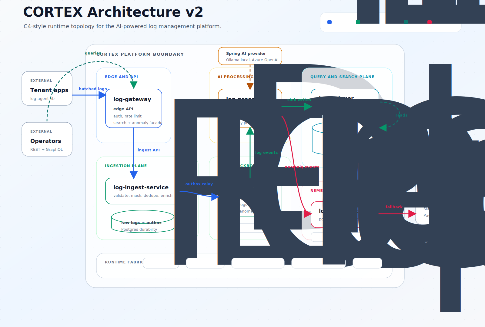

# CORTEX Architecture V2

> Visual-first architecture reference for the CORTEX runtime. This version uses
> a checked-in SVG diagram instead of Mermaid or ASCII so the GitHub page looks
> more like a product architecture page and less like generated graph output.

## System Topology

CORTEX is split into five runtime planes:

- Edge/API: public entry point for ingest, search, anomaly reads, and natural-language query translation.
- Ingestion: validates, masks, deduplicates, enriches, and durably accepts raw log events.
- Eventing and AI processing: moves accepted logs through Kafka, classifies them, and fans out to search/remediation.
- Query/search: owns search APIs, Quickwit administration, and reads across Postgres, Loki, and Quickwit.
- Remediation: owns anomaly response, policy/playbook execution, audit outcomes, and human fallback dispatch.

## Ownership Map

| Area | Runtime owner | Main responsibility |
| --- | --- | --- |
| Edge API | `log-gateway` | Auth, rate limiting, REST ingest, GraphQL reads |
| Ingest | `log-ingest-service` | Validation, PII masking, dedupe, raw log persistence, outbox |
| Event backbone | Postgres + Kafka | Durable handoff from accepted logs to async processors |
| AI processing | `log-processor-service` | Parsing, anomaly classification, sink fan-out, anomaly event publishing |
| Search plane | `log-indexer-service` | Query routing, Quickwit admin, Loki/Quickwit/Postgres access |
| Remediation | `log-remediation-service` | Anomaly read model, policy, playbooks, audit outcomes, fallback dispatch |
| Runtime support | Redis, Eureka, Prometheus, Grafana, OpenTelemetry | Dedupe, rate limits, discovery, SLOs, dashboards, traces |

## Search Shape

| Query type | Primary backend | Why |
| --- | --- | --- |
| Structured filters | Postgres | JSONB, GIN indexes, tenant-scoped predicates |
| Label and time scans | Loki | Fast label slicing for service, level, anomaly, and tenant |
| Free text and fuzzy search | Quickwit | Full-text search over larger log volumes |

## Remediation Contract

The processor owns anomaly detection. The remediation service owns deterministic
response. That boundary keeps AI classification separate from operational
actions:

- Processor emits only validated anomaly CloudEvents.
- Remediation deduplicates with Redis before policy evaluation.
- Auto-fix is attempted only when the matching policy allows it.
- `fixed` outcomes stay silent.
- `skipped` and `failed` outcomes are audited and can dispatch Slack, PagerDuty, or Jira.

## Diagram Source

The visual diagram is source-controlled at
[`docs/assets/cortex-architecture-v2.svg`](assets/cortex-architecture-v2.svg).
Edit the SVG directly when the architecture changes; no Mermaid renderer is
required for this version.
