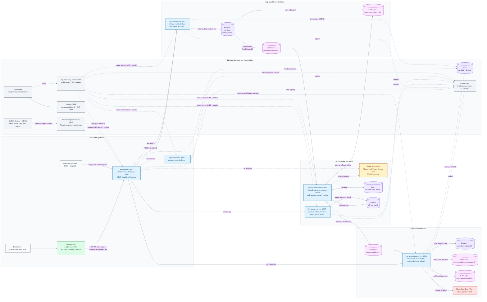

# CORTEX - Architecture

> Cognitive Observability Runtime Telemetry EXchange.
> AI-powered intelligent log management system.

This document is the canonical, public-facing architecture reference.
For the high-level "what is CORTEX" pitch, see the top-level
[README](../README.md). For phase-by-phase delivery sequencing, see
[PHASES.md](./PHASES.md). For the rationale behind individual choices,
see [Architecture Decision Records](./adr/).

---

## 1. System overview

CORTEX ingests structured and unstructured logs from any source, enriches
them with AI-derived semantics in the processor, stores parsed events across
the search tiers, and exposes reads through REST and GraphQL. Valid anomaly
events flow into a deterministic remediation stage that tries policy-gated
auto-fix first, writes a tenant-scoped anomaly read model, audits every
decision, and escalates humans only when the auto-fix is skipped or failed.

Solid arrows are runtime data flow. Dotted arrows are control-plane,
observability, or operator paths.



---

## 2. Modules

| Module                   | Purpose                                                 | Port (local) |
| ------------------------ | ------------------------------------------------------- | ------------ |
| `log-agent-lib`          | Thin Java client SDK. Buffer, retry, gzip, sign.        | n/a (lib)    |
| `log-gateway`            | Edge. Auth (JWT + API key), rate limit, multi-tenant.   | 8090         |
| `log-ingest-service`     | Receives logs (REST), validates, publishes to bus.      | 8092         |
| `log-echo-service`       | Throwaway downstream stub for gateway smoke tests (ADR-0016). | 8093 |
| `log-processor-service`  | Consumes Kafka, parses, AI-classifies anomalies, fans out. | 8095      |
| `log-remediation-service`| Anomaly read model, fix-first remediation, audit outcomes, human fallback. | 8096 |
| `log-indexer-service`    | Persists/searches Postgres + Loki + Quickwit. Owns Quickwit. | 8097      |
| `log-monitoring-service` | SLO, alerting, OTel collection, Grafana datasource.     | 8098         |
| `eureka-server`          | Local-dev service registry (ADR-0016). K8s uses Service DNS in prod. | 8761 |
| `wiremock` (smoke only)  | Stubs the Ollama `/api/chat` upstream for P3.3 NL→LogQL tests (ADR-0018). | 8094 (host) |
| `postgres` (smoke only)  | Local Postgres 16 for `log-ingest-service` Flyway baseline. | 5432 |
| `redis` (smoke only)     | Bucket4j + Lettuce backend for distributed rate limiting (B5.1). | 6379 |

All modules share the parent POM (`cortex-parent`) and inherit the same
quality gates (Checkstyle, SpotBugs, JaCoCo, OWASP, Enforcer).

---

## 3. Three-tier search

CORTEX runs all three search backends on Day 1 (locked decision LD3):

| Tier      | Backend  | Strength                                | Owner               |
| --------- | -------- | --------------------------------------- | ------------------- |
| Tier 1    | Postgres | Structured filters, JOINs, JSONB + GIN  | `log-indexer`       |
| Tier 2    | Loki     | Label-based queries, hot/warm + Blob    | `log-indexer`       |
| Tier 3    | Quickwit | Full-text, sub-second over TB-scale     | `log-indexer`       |

The `searchLogs` API (REST + GraphQL) routes the query to the right tier
based on the query shape:

- Predicate-heavy structured filter -> Postgres.
- Label or time-range scan -> Loki.
- Free-text or fuzzy match -> Quickwit.

A natural-language query (`nlToLogQL`) translates the user prompt to
LogQL (or SQL or Quickwit DSL) via Spring AI.

---

## 4. APIs

### 4.1 REST (Day 1)

Ingestion (high throughput, REST only):
- `POST /v1/ingest`                  - batch ingest
- `POST /v1/ingest/stream`           - streamed (newline-delimited JSON)

Query (REST + GraphQL parity):
- `GET  /v1/logs/search?...`         - searchLogs
- `GET  /v1/logs/{id}`               - getLogById
- `POST /v1/logs/nl-to-logql`        - nlToLogQL
- `GET  /v1/anomalies?...`           - getAnomalies

Implemented P9.3a direct remediation read backer:
- `GET  /api/v1/anomalies?tenantId&since&until&limit` - remediation-owned anomaly read model

### 4.2 GraphQL (Day 1)

Single endpoint: `POST /graphql`. Four query operations only:

```graphql
type Query {
  searchLogs(input: LogSearchInput!): LogSearchResult!
  getLogById(id: ID!): LogEntry
  nlToLogQL(prompt: String!): String!
  getAnomalies(input: AnomalyFilter!): [Anomaly!]!
}
```

No GraphQL mutations Day 1 (LD4 + RA5). Ingestion remains REST-only
because it is throughput-dominant and uses API-key auth, not OAuth.

---

## 5. AI provider abstraction

The `log-processor-service` and the `nlToLogQL` endpoint use Spring AI
(1.0.0) behind a thin `AiProvider` interface. Two implementations Day 1:

- **Ollama** (local dev) - free, offline, model = `llama3.1:8b`.
- **Azure OpenAI** (prod) - gpt-4o-mini for enrichment, gpt-4o for NL->LogQL.

Selection is per-tenant via configuration; Resilience4j wraps every call.
See [ADR-0006](./adr/0006-ai-provider-abstraction.md).

---

## 6. Auto-remediation

`log-processor-service` owns AI anomaly classification and publishes
valid anomaly CloudEvents to `cortex.anomalies.v1`. `log-remediation-service`
owns the deterministic response:

1. Parse the anomaly envelope; malformed envelopes go to
   `cortex.anomalies.v1.dlq`.
2. Persist a fail-open copy of the valid anomaly into the remediation-owned
   Postgres `anomalies` read model for `GET /api/v1/anomalies`.
3. Claim `{tenantId}:{eventId}` in Redis with SETNX so Kafka rebalances
   and duplicate deliveries do not double-remediate.
4. Resolve a `RemediationPolicy` and matching `RemediationPlaybook`.
5. Dry-run first; apply only when policy allows `autoApply`.
6. Publish every valid non-duplicate decision to
   `cortex.remediation.outcomes.v1`.
7. Treat `fixed` as silent success. For `skipped` or `failed`, call the
   active Slack, PagerDuty, or Jira dispatcher through a Resilience4j guard.

There is no generic DLQ-2 for valid remediation misses. Valid misses are
audited as outcomes and escalated to humans; only malformed anomaly input
uses the anomaly DLQ. The query/read side does not replay Kafka history; it
reads the service-owned `anomalies` table. See
[ADR-0051](./adr/0051-log-remediation-auto-remediation-pipeline.md),
[ADR-0052](./adr/0052-log-remediation-anomaly-read-model.md), and
[ADR-0007](./adr/0007-self-healing-playbooks.md).

---

## 7. Observability

- **Tracing**: OpenTelemetry SDK on every service, OTLP -> Tempo.
- **Metrics**: Micrometer -> Prometheus.
- **Logs (self)**: Logback `loki4j` appender pushes service logs to the
  same Loki cluster CORTEX serves (dog-fooding).
- **Dashboards + SLOs**: Grafana, provisioned via `infra/grafana/`.
  Prometheus remains the alert-rule evaluator; Grafana is the provisioned
  read-side operator UI. P17 ships `CORTEX Overview`, `CORTEX SLO`, and the
  availability SLO catalog. `log-monitoring-service` owns the runtime SLO
  engines, including micrometer-derived availability plus counter-family,
  timer-percentile, PromQL, composite, OTel, and `mixed` advanced backends
  (ADR-0046 Amendments 4-5).

See [ADR-0011](./adr/0011-observability.md) and
[ADR-0056](./adr/0056-p17-grafana-slo-dashboards.md).

---

## 8. Multi-tenancy

Every record carries `tenantId` (UUID v4). B-tree index on every table.
Tenant context is propagated through:

- HTTP header `X-Tenant-Id` (validated by gateway against JWT claim).
- MDC (`tenant_id`) for logs.
- OTel baggage for traces.
- Message bus header for async hops.

See [ADR-0009](./adr/0009-tenant-isolation.md).

---

## 9. Tech stack at a glance

| Layer        | Choice                                                          |
| ------------ | --------------------------------------------------------------- |
| Language     | Java 17 LTS (no virtual threads; LD1)                           |
| Framework    | Spring Boot 3.3.5, Spring Cloud 2023.0.4, Spring AI 1.0.0       |
| Build        | Maven 3.9.9 (script-only wrapper)                               |
| Persistence  | Postgres 16 (GIN), Loki 3.x, Quickwit 0.8                       |
| Message bus  | Kafka for the implemented local/dev + verified flows; Azure Service Bus remains the intended prod target, but the connector is not live yet |
| AI           | Ollama (local), Azure OpenAI (prod), Spring AI abstraction      |
| Resilience   | Resilience4j 2.2.0 on every egress                              |
| Observability| OpenTelemetry 1.43.0, Micrometer, Grafana, Tempo, Loki          |
| Container    | Multi-stage Dockerfiles, Eclipse Temurin JRE runtime            |
| CI/CD        | GitHub Actions, GHCR, Trivy image scan, keyless cosign          |
| Orchestration| Helm 3 charts, Kubernetes 1.30+                                 |
| IaC          | Terraform (Azure), Ansible (configuration + remediation)        |
| Tests        | JUnit 5, Testcontainers 1.20, REST Assured, Postman + Newman    |
| Quality gates| Checkstyle, SpotBugs + FindSecBugs, JaCoCo 80%, OWASP DC, SBOM  |

For each choice, see the corresponding ADR in [docs/adr/](./adr/).

---

## 10. Deployment

The deployment path is layered:

1. **P10 Docker** builds one image per runnable service and proves the full
   local ring with `infra/docker/docker-compose.yml`.
2. **P11 Helm** deploys application workloads with one umbrella chart,
   `infra/helm/cortex`, plus one chart per service. Kubernetes resource names
   intentionally match the P10 names: `cortex-gateway`, `cortex-ingest`,
   `cortex-processor`, `cortex-remediation`, `cortex-indexer`,
   `cortex-monitoring`, `cortex-echo`, and `cortex-eureka`.
3. **P12 Terraform** provisions Azure infrastructure and feeds
   environment-specific Helm values: Resource Group, AKS, ACR, Key Vault,
   Blob storage, App Insights/Log Analytics, Service Bus topics, and optional
   Postgres/Redis toggles.
4. **P13 Ansible** runs the operator workflow on top of those layers:
    Terraform validation/provision, Helm deploy, Helm rollback, and rollout +
    gateway health smoke.
5. **P14 CI/CD** runs root `mvn verify` with Docker-backed Testcontainers,
   retains verification artifacts, builds all eight P10 images, scans each
   image with Trivy (blocking on fixable HIGH/CRITICAL, framework-locked
   residuals allowlisted), publishes GHCR images only on trusted push/tag
   events, and signs pushed digests with keyless cosign.
6. **P17 Grafana** mounts the provisioned dashboards and datasource from
   `infra/grafana` into the local/full Docker stacks. Grafana is an operator
   UI layer; Prometheus alert rules remain under `infra/local/alerts`.
7. **P18 release prep** provides the v0.1.0 release runbook and guarded
   SBOM/cosign/GitHub Release scripts. The real tag/sign/publish step requires
   explicit operator approval.

P11 owns application Deployments/Services only. Stateful dependencies
(`cortex-postgres`, `cortex-redis`, `cortex-kafka`, `cortex-quickwit`, and
`cortex-wiremock`/AI endpoint) are external inputs supplied by local P10
infrastructure or by P12-managed Azure resources. See
[ADR-0053](./adr/0053-p11-helm-kubernetes-charts.md) and
[ADR-0054](./adr/0054-p12-terraform-azure-infrastructure.md).

Azure Service Bus is provisioned in P12 as the intended production broker,
but the currently implemented service runtime remains Kafka-wired. The
Service Bus cutover is an application/binder migration, not something
Terraform can truthfully imply by itself.

P13 playbooks are orchestration only. They call Terraform, Helm, and kubectl;
they do not define a second infrastructure or manifest model. See
[ADR-0055](./adr/0055-p13-ansible-operational-orchestration.md).

P14 is the CI/CD boundary. Pull requests verify, build, and Trivy-scan images
without publishing; trusted `main` and `v*.*.*` events publish SHA/tagged
images to GHCR and sign pushed digests via keyless cosign. See
[ADR-0058](./adr/0058-p14-ci-cd-pipeline.md).

P18 does not imply that a release has been published. The repository contains
the release-prep lane; the actual `v0.1.0` publication is a separate guarded
operation. See [ADR-0057](./adr/0057-p18-release-prep-and-publish-gate.md).

---

## 11. Reading order

If you're new to CORTEX:

1. This document (architecture).
2. [PHASES.md](./PHASES.md) - delivery sequencing.
3. [ADR-0001](./adr/0001-language-and-runtime.md) onward, in numeric order.
4. The README's "Quick start" for local bring-up.
